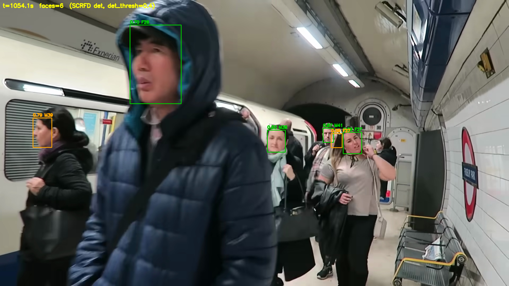
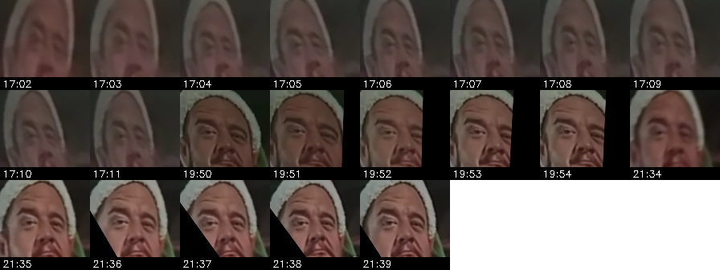
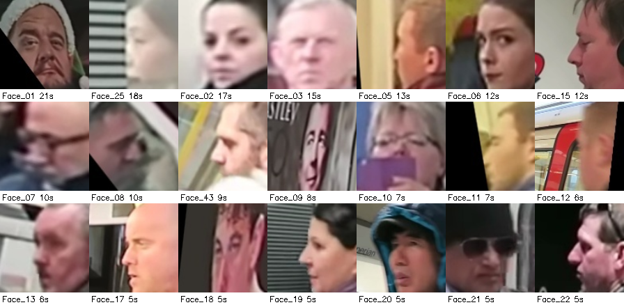
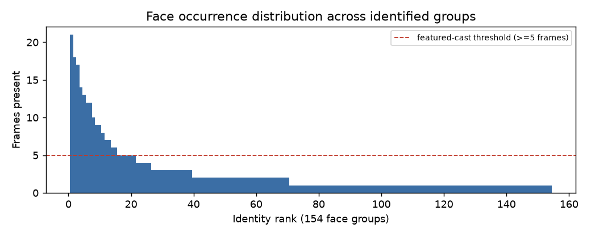

# Video Face Analytics Pipeline

Detects, recognizes, and groups faces in a video, then reports how often each unique
person appears and who appears most. Built around InsightFace (SCRFD detection +
ArcFace embeddings) with a coherence-guaranteed, self-validating grouping stage.

**Source video:** https://www.youtube.com/watch?v=d2g9HlwoC-s

> The video, extracted frames, face crops, and the local virtualenv are **not**
> committed (copyrighted source, real faces, and size). They are regenerated by
> running the pipeline. See `.gitignore`.

---

## Demo & Verification

**Face detection on a frame** — SCRFD detections drawn on the busiest sampled frame
(green = quality-passed, orange = lower quality; each box labelled with confidence and
estimated gender/age). The foreground person facing away is correctly not boxed.



This is the same overlay the live preview (`preview_faces.py`) renders while the video
plays.

**Grouped identity across scenes** — all crops the system assigned to the most
frequent identity (`Face_01`), consolidated across three separate scenes:



**Featured cast** — one representative crop per featured identity (groups with ≥5
frames of presence), labelled with screen time:



**Occurrence distribution** — frames-present per group across all identified groups:



### Result summary (current run)

| Metric | Value |
|--------|-------|
| Extracted frames (1 FPS, 1080p) | 1,415 |
| Detected face crops | 435 |
| Face groups / featured cast (≥5 frames) | 154 / 21 |
| Most frequent face | Face_01 — 21 frames / 9 appearances / 21.0 s |
| Co-occurrence precision (label-free) | 1.0000 |
| Tracking-continuity recall (label-free) | 0.83 |
| Unit tests | 27 passing |

Full write-up: **`reports/TECHNICAL_REPORT.docx`**; methodology and alternatives in
`DOCUMENTATION.md`.

---

## Pipeline stages
1. **Download** (`download.py`) — fetch the video (up to 1080p) with `yt-dlp`.
2. **Frame extraction** (`extract_frames.py`) — **1 FPS** via `supervision`, with
   accurate timestamps.
3. **Detection + tracking** (`detect_faces.py`) — InsightFace **SCRFD-10GF**; aligned
   112×112 crops, **ArcFace** 512-D embeddings, **ByteTrack** linking, per-face
   quality (blur/pose) and gender/age.
4. **Recognition & grouping** (`recognize.py`) — per-track quality-weighted templates,
   **constrained complete-linkage clustering** (cosine) with a co-occurrence
   cannot-link constraint, a **best-shot cross-scene linking** pass, and a
   corroboration backstop. Optional clothing/body re-ID is available but off by
   default.
5. **Analytics** (`analytics.py`) — screen-time, appearances, demographics, montages,
   annotated frames, timeline, `reports/report.html` + `summary.{json,md}`.
6. **Evaluation** (`eval.py`, `eval_cooccurrence.py`, `eval_continuity.py`) —
   complete-linkage threshold sweep + label-free precision/recall checks.

## Setup
```bash
python3.12 -m venv .venv
.venv/bin/python -m pip install -r requirements.txt
```
Requires `ffmpeg` on PATH.

### Optional: cross-scene clothing re-ID
An orthogonal appearance signal (same outfit across scenes) that consolidates a person
whose face pose varies too much for face embeddings alone. Off by default; needs extra
dependencies and is recommended only with the human review step:
```bash
.venv/bin/python -m pip install -r requirements-appearance.txt
# set config.APPEARANCE_ENABLE = True, then re-run the pipeline
```

## Run
```bash
.venv/bin/python run_pipeline.py            # full pipeline (config-aware, idempotent)
.venv/bin/python run_pipeline.py --force    # rerun every stage
.venv/bin/python run_pipeline.py --no-eval  # skip the eval harness
.venv/bin/python preview_faces.py           # live detection overlay while the video plays
```

## Tests
```bash
.venv/bin/python -m pytest -q
```

## Key tuning (`config.py`)
- `FPS` — sampling rate (1 FPS per the project spec).
- `DET_SIZE`, `DET_THRESH`, `MIN_FACE_PX` — detection resolution / sensitivity / size filter.
- `CLUSTER_LINK_DIST` — complete-linkage grouping threshold.
- `BEST_SHOT_DIST` — cross-scene frontal-match threshold.
- `MIN_IDENTITY_FACES`, `REAL_FACE_DET` — corroboration backstop (drops lone non-faces).
- `RECURRING_MIN_FRAMES` — featured-cast presence threshold.
- `APPEARANCE_ENABLE` — enable optional clothing/body re-ID.
