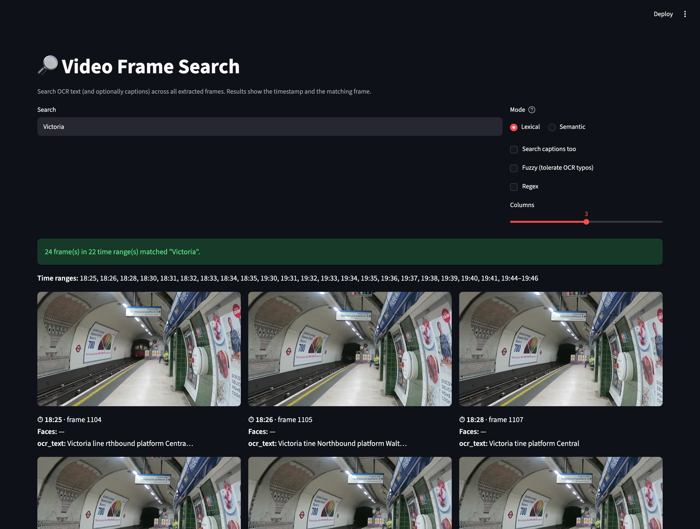
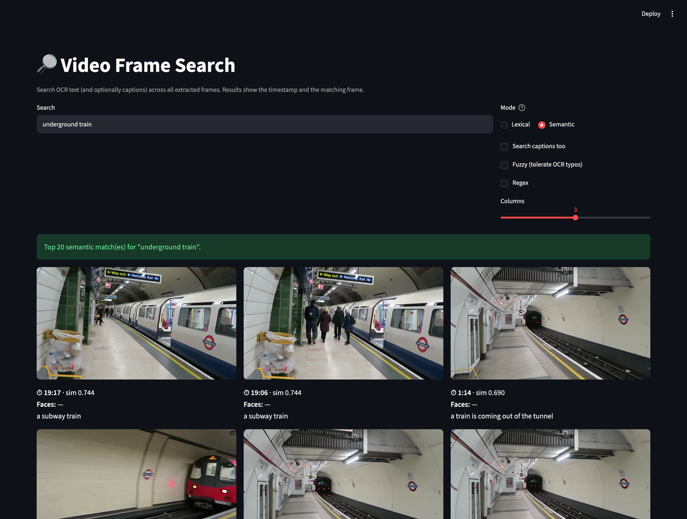
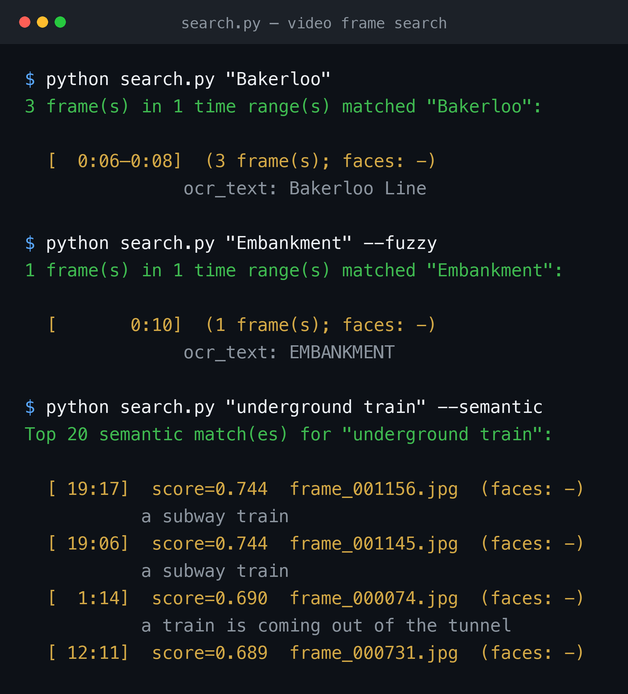
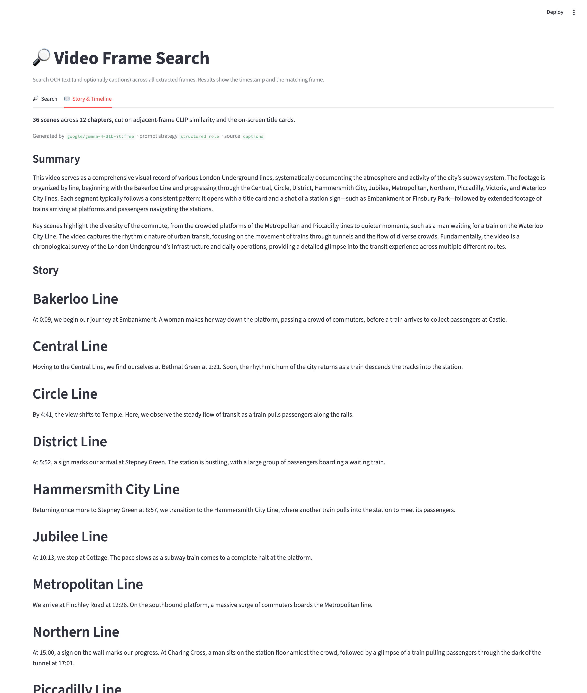
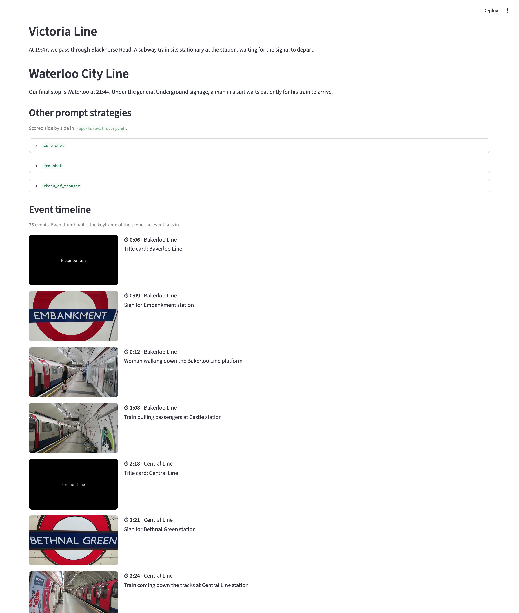

# Video Face Analytics Pipeline

An end-to-end computer-vision pipeline that takes a single video and answers one
question rigorously: **who appears in it, and how often?** It detects every face,
tracks each face through time, groups the tracks into unique identities across
scenes, and produces an occurrence report — screen time, appearance counts, and a
ranked "featured cast" — alongside annotated frames and per-identity montages.

It is built around **InsightFace** (SCRFD detection + ArcFace embeddings) with a
**coherence-guaranteed, self-validating grouping stage**: instead of trusting the
clustering blindly, the pipeline measures its own correctness with label-free
checks (two faces in the same frame can never be the same person) and reports the
numbers.

A second layer (**Milestone 2**) makes the video *searchable*: every frame is
OCR'd and captioned, then joined with its face IDs into a structured metadata
repository you can query by word or phrase. See
[Milestone 2: searchable frame dataset](#milestone-2-searchable-frame-dataset).

**Source video:** https://www.youtube.com/watch?v=d2g9HlwoC-s

> The video, extracted frames, face crops, and the local virtualenv are **not**
> committed (copyrighted source, real faces, and size). They are regenerated by
> running the pipeline. See `.gitignore`.

---

## What it does

- **Detects** faces in every sampled frame with bounding boxes, confidence,
  5-point landmarks, and estimated gender/age.
- **Tracks** each face across consecutive frames (ByteTrack) so an appearance is
  not fragmented into dozens of disconnected detections.
- **Groups** tracks into unique people — including the same person recurring in
  different scenes, lighting, and pose — without knowing the number of people in
  advance.
- **Quantifies** each identity: distinct appearances, screen time in seconds, and
  per-frame presence.
- **Ranks** the cast and names the single most frequently appearing person.
- **Validates** its own grouping with label-free precision/recall metrics, so the
  result is a measured number rather than a guess.
- **Reports** everything as `report.html`, `summary.{json,md}`, annotated frames,
  per-identity montages, and an appearance timeline.

## Highlights

- **No K required.** The number of distinct people is unknown a priori, so
  grouping uses constrained complete-linkage clustering over cosine distance — not
  K-Means.
- **Cannot-link constraints.** Faces co-occurring in one frame are forced apart,
  which both improves grouping and provides a free correctness test.
- **Cross-scene linking.** A best-shot frontal-match pass consolidates the same
  person across separate scenes; a corroboration backstop drops lone non-faces.
- **Idempotent stages.** Each stage fingerprints its config and only reruns when
  inputs or settings change — fast iteration, inspectable intermediates.
- **Searchable frame dataset (Milestone 2).** Every frame is OCR'd and captioned,
  and joined with its face IDs into one structured metadata repository that powers
  both keyword and **semantic** (embedding-based) search over the whole video.
- **Self-checking.** 54 unit tests plus two label-free evaluation harnesses run as
  part of the pipeline.

---

## Demo & Verification

**Face detection on a frame** — SCRFD detections drawn on the busiest sampled frame
(green = quality-passed, orange = lower quality; each box labelled with confidence and
estimated gender/age). The foreground person facing away is correctly not boxed.


This is the same overlay the live preview (`preview_faces.py`) renders while the video
plays.

**Grouped identity across scenes** — all crops the system assigned to the most
frequent identity (`Face_01`), consolidated across three separate scenes:


**Featured cast** — one representative crop per featured identity (groups with ≥5
frames of presence), labelled with screen time:


**Occurrence distribution** — frames-present per group across all identified groups:


### Result summary (current run)

| Metric | Value |
|--------|-------|
| Extracted frames (1 FPS, 1080p) | 1,415 |
| Detected face crops | 435 |
| Face groups / featured cast (≥5 frames) | 154 / 21 |
| Most frequent face | Face_01 — 21 frames / 9 appearances / 21.0 s |
| Co-occurrence precision (label-free) | 1.0000 |
| Tracking-continuity recall (label-free) | 0.83 |
| Frames with OCR text / captions (Milestone 2) | 180 / 1,415 |
| Scenes / chapters (Milestone 3) | 36 / 12 |
| Story chronology · timeline events (Milestone 3) | 1.00 · 35 |
| Caption adequacy vs. vision — BLIP's ceiling (Milestone 3) | 0.11 |
| Unit tests | 97 passing |

Methodology, model choices, and alternatives: `DOCUMENTATION.md`.

---

## Pipeline stages
1. **Download** (`download.py`) — fetch the video (up to 1080p) with `yt-dlp`.
2. **Frame extraction** (`extract_frames.py`) — **1 FPS** via `supervision`, with
   accurate timestamps derived from the true source frame index.
3. **Detection + tracking** (`detect_faces.py`) — InsightFace **SCRFD-10GF**; aligned
   112×112 crops, **ArcFace** 512-D embeddings, **ByteTrack** linking, per-face
   quality (blur/pose) and gender/age.
4. **Recognition & grouping** (`recognize.py`) — per-track quality-weighted templates,
   **constrained complete-linkage clustering** (cosine) with a co-occurrence
   cannot-link constraint, a **best-shot cross-scene linking** pass, and a
   corroboration backstop. Optional clothing/body re-ID is available but off by
   default.
5. **Analytics** (`analytics.py`) — screen-time, appearances, demographics, montages,
   annotated frames, timeline, `reports/report.html` + `summary.{json,md}`.
6. **OCR** (`ocr.py`) — Tesseract over every frame, confidence-filtered and
   **domain-lexicon corrected** (snaps "Metropolite"→Metropolitan, "tine"→line), → `data/ocr.csv`.
7. **Captioning** (`caption.py`) — BLIP-base scene captions (Apple MPS / CPU), → `data/captions.csv`.
8. **Metadata repository** (`build_metadata.py`) — joins frame → face IDs → OCR text
   → caption into `data/frame_metadata.{json,csv}`.
9. **Semantic index** (`embed_text.py`) — embeds each frame's caption + OCR text with
   a sentence-transformer → `data/embeddings/text_embeddings.npz`.
10. **Visual index** (`embed_image.py`) — CLIP image vectors per frame, so retrieval
    is not hostage to caption quality → `data/embeddings/image_embeddings.npz`.
11. **Scene segmentation** (`scenes.py`) — cuts on adjacent-frame CLIP similarity +
    title cards → `data/scenes.json` (Milestone 3).
12. **Narration** (`describe_scenes.py`, `narrate.py`) — story, summary and event
    timeline via Gemma 4; the only network stages, and skippable → `data/story.json`,
    `data/timeline.json` (Milestone 3).
13. **Evaluation** (`eval.py`, `eval_cooccurrence.py`, `eval_continuity.py`) —
    complete-linkage threshold sweep + label-free precision/recall checks.
14. **System evaluation** (`eval_system.py`) — rolls the per-stage timings and every
    milestone's accuracy harness into `reports/eval_system.{json,md}` (Milestone 4).

Stages communicate through CSV/artifact files under `data/`, so any stage can be
rerun in isolation and every intermediate is inspectable. Each stage is timed
through `util.time_stage` and fingerprints its config, so it reruns only when its
inputs or settings actually change.

## Milestone 2: searchable frame dataset

On top of the face analytics, the pipeline builds a structured, searchable dataset
over every frame so the video can be queried by **what is written or shown** in it,
not just who appears.

- **OCR** (`ocr.py`) extracts visible text per frame with Tesseract. A per-token
  confidence gate (`OCR_MIN_CONF`) keeps the index clean, then a **domain-lexicon
  correction pass** snaps each surviving token to its nearest London-Underground
  term by edit-distance (e.g. `Metropolite`→`Metropolitan`, `Southbo`→`Southbound`,
  `Victoria tine`→`Victoria line`) — precision-first, so real words in a stop-list
  are never rewritten. → `data/ocr.csv`.
- **Captions** (`caption.py`) generate a descriptive caption per frame with
  **BLIP-base** (`Salesforce/blip-image-captioning-base`), running on Apple **MPS**
  when available. The model loads once and frames stream one-by-one, so it stays
  within ~2–3 GB RAM (runs comfortably on an 8 GB M2). → `data/captions.csv`.
- **Metadata repository** (`build_metadata.py`) joins each frame with its **face
  IDs** (via the same `faces → identities` join the analytics uses), OCR text, and
  caption into `data/frame_metadata.json` (canonical, `face_ids` as an array) and
  `data/frame_metadata.csv`. This is the dataset future milestones consume.
- **Semantic index** (`embed_text.py`) embeds each frame's caption + OCR text with
  a compact sentence-transformer (`all-MiniLM-L6-v2`, ~80MB, MPS/CPU) into a
  normalized vector index, so queries can match by **meaning** rather than literal
  text.

### Search

Search the dataset for a word or phrase and get back the timestamps and frames
where it appears. Consecutive frames showing the same text are collapsed into one
time range, so a title card on screen for six seconds reads as a single hit:

```bash
.venv/bin/python search.py "Bakerloo"                   # OCR text (grouped ranges)
.venv/bin/python search.py "platform" --captions        # also search captions
.venv/bin/python search.py "embankment" --fuzzy         # tolerate OCR typos
.venv/bin/python search.py "Line \d+" --regex            # regex search
.venv/bin/python search.py "underground train" --semantic  # search by meaning
.venv/bin/python search.py "Welcome" --open              # open the matching frames
.venv/bin/python -m streamlit run search_app.py         # interactive UI (lexical + semantic)
```

**Lexical** — `search.py "Bakerloo"` →
`[ 0:06–0:08 ] (3 frame(s)) ocr_text: Bakerloo Line`. Each result carries the face
IDs present and a snippet of the matched text; `--no-group` lists every frame.

**Semantic** — `search.py "underground train" --semantic` ranks frames by embedding
similarity, surfacing captions like *"a subway train"* and *"a train coming out of
the tunnel"* that share **no literal words** with the query.

**Visual** — `search.py "an escalator" --visual` ranks by CLIP image content, so it
finds frames whose captions never mention the query at all.

**Fused** — `search.py "underground train" --fused` combines the semantic and visual
rankings with Reciprocal Rank Fusion, so either index can rescue a query the other
misses. On the 10-query eval set it reaches **precision@5 = 0.90**, ahead of semantic
alone (0.84) and visual alone (0.42).

The Streamlit app exposes all four modes (a Lexical/Semantic/Visual/Fused toggle) plus
the fuzzy/regex/caption options, and is **deep-linkable**: the controls seed from URL
query params (`?q=underground+train&mode=Fused`), so any result view can be shared or
bookmarked.

### Milestone 2 in action

**Lexical OCR search** — `Victoria` finds every frame whose on-platform signage
reads "Victoria line", grouped into time ranges, each frame card showing its
timestamp, the face IDs present, and the matched OCR text:



**Semantic search** — `underground train` ranks frames by *meaning*. The top hits are
captioned *"a subway train"* and *"a train is coming out of the tunnel"* — none of
which contain the words "underground" or "train" — with their cosine similarity
scores shown:



**Command line** — the same search core powers a CLI. Consecutive frames with the
same text collapse into one time range; `--fuzzy` absorbs OCR typos and `--semantic`
switches to embedding ranking:



## Milestone 3: story, summary & event timeline

Milestone 3 builds *higher-level understanding* on top of the per-frame dataset: a
chronological **story**, an overall **summary**, an **event timeline**, and three
new metadata fields (`scene_index`, `story_segment`, `event_description`).

The obstacle is that the captions cannot be narrated as-is. Across 1,415 frames
BLIP produces only **342 distinct captions** and flickers between synonyms on
identical frames (*"a train is pulling passengers"* ×72), so naively collapsing
repeats yields 904 fragments — noise, not scene structure. The pipeline therefore
compresses the video into **~36 scene digests** first, then narrates from those.

**Scene segmentation (`scenes.py`, offline).** Adjacent-frame CLIP cosine over the
Milestone 2 image index cuts the video where the picture changes; a title-card
detector forces a hard cut at each Underground-line card. Two independent signals
agree — the sharpest cosine drops land exactly on the title cards — recovering the
video's authored structure: an intro plus 11 lines (Bakerloo → Waterloo & City).
Each scene stores its span, face IDs, station signage, and a **CLIP-medoid
keyframe**.

**Narration (`narrate.py` → Gemma 4 via OpenRouter).** All ~36 digests fit in one
262k-context prompt, so the story is generated in a single pass and chronological
coherence is structural, not stitched. Four prompt strategies are compared
(`zero_shot`, `few_shot`, `chain_of_thought`, `structured_role`) and scored by
`eval_story.py`. The timeline is *validated, not trusted*: timestamps must parse,
lie in range, and run forwards, else they are repaired or fall back to scene
boundaries.

**Grounding & the caption ceiling (`describe_scenes.py`).** Gemma 4 also
re-describes each scene's keyframe from the *image*. This is an independent
reference for scoring hallucination — and it quantifies BLIP's ceiling: across 24
keyframes, BLIP's caption captures only **11%** of the content words the vision
model reads in the same frame, and **every** scene falls below 25%. An ablation
story narrated from the richer descriptions confirms the narrator was never the
bottleneck; the captions were.

Every model response is cached to `data/llm_cache/` (the one part of `data/` that
is committed), so `pytest` and `eval_story.py` **replay offline with no API key** —
the repo keeps its reproducible-on-a-fresh-clone guarantee.

### Milestone 3 evaluation

Scored by `eval_story.py` over the four prompt strategies (all narrating the same
digests):

| Strategy | Chronology | Chapter coverage | Redundancy (distinct-3-gram) | Grounding vs. VLM |
|----------|-----------|------------------|------------------------------|-------------------|
| `zero_shot` | 1.00 | 1.00 | 0.87 | 0.36 |
| `few_shot` | 1.00 | 0.92 | 0.69 | 0.46 |
| `chain_of_thought` | 1.00 | 1.00 | 0.87 | 0.35 |
| `structured_role` | 1.00 | 0.92 | 0.97 | 0.26 |

Every strategy is perfectly chronological (Task 2, *verified* not asserted). The
strategies trade off differently — `structured_role` is the least repetitive,
`few_shot` the best-grounded — the honest finding being that **prompt engineering
moves chronology and redundancy, but only better captions move grounding**
(ablation: 0.26 → 0.36 when narrating from the vision descriptions). The event
timeline is 35 events, 100% within real scene spans, strictly chronological.

### Milestone 3 in action

**Story & summary** — the Streamlit app's new *Story & Timeline* tab renders the
one-pass summary and the chaptered story, one section per Underground line:



**Event timeline** — each event shows its timestamp, the line it belongs to, and
the scene's keyframe — black title cards, station roundels, and platform footage:



## Milestone 4: integrated system & evaluation

Milestone 4 does not add a new perception capability. It closes the system: one
executable pipeline, one application over every artifact, and one honest account
of what the whole thing costs and how well it works.

**One pipeline.** `run_pipeline.py` runs all fourteen stages end to end, from a
URL to a narrated, searchable dataset. It was already the integration point; what
Milestone 4 adds is that every stage is now timed through `util.time_stage` and
its duration merged into `data/stage_timings.json`. The merge is the interesting
part: the pipeline is idempotent, so on any run after the first most stages skip
and would measure ~0s. Each stage therefore keeps its last *measured* duration
until it genuinely reruns, and the file always describes a full cold build even
though it was assembled across several runs.

**One application.** `search_app.py` grows from two tabs to five — Dashboard,
Search, Faces, Captions & OCR, and Story & Timeline — covering every Task 2 and
Task 3 requirement over the artifacts the pipeline already produces. Each tab
degrades to an instruction rather than an exception when its stage has not run, so
a Milestone 1 user with no captions and no API key still gets a working app.

**One evaluation.** `eval_system.py` is a reducer, not a new measurement: it reads
the stage timings and the JSON already emitted by every milestone's harness and
reports processing time, output quality, and limitations. Its one design
commitment is that **the limitations are derived from the metrics rather than
written beside them** — each finding is a predicate over the numbers, so improving
a number removes its finding from the next report automatically. A limitations
section that cannot go stale is the only kind worth committing.

Timing is reported as local compute *separately* from network wait. The narration
stages measure how long a free-tier OpenRouter endpoint made us queue, so folding
them into a throughput figure would report someone else's rate limiter as this
pipeline's latency.

See [`docs/milestone4_methodology.md`](docs/milestone4_methodology.md) for the full
write-up and [`reports/eval_system.md`](reports/eval_system.md) for the generated
report.

## Outputs

After a run, results land in `reports/` and `data/`:

| Artifact | Description |
|----------|-------------|
| `reports/report.html` | Single-page visual report: featured cast, montages, timeline. |
| `reports/summary.json` / `summary.md` | Machine- and human-readable occurrence statistics. |
| `reports/pipeline.log` | Console + file log of the full run. |
| `data/frames.csv` | Frame id → filename → timestamp mapping. |
| `data/faces.csv` | Every detection with box, score, quality, demographics. |
| `data/identities.csv` | Per-track identity assignment after grouping. |
| `data/embeddings/embeddings.npz` | 512-D ArcFace embeddings keyed by crop id. |
| annotated frames / montages | Boxes + Face IDs, one representative crop per identity. |
| `data/ocr.csv` | Per-frame OCR text + face IDs, token count, mean confidence (Milestone 2). |
| `data/captions.csv` | Per-frame BLIP caption + face IDs + OCR text (Milestone 2). |
| `data/frame_metadata.{json,csv}` | Frame → timestamp → face IDs → OCR → caption → **scene_index → story_segment → event_description** (M2 + M3 Task 4). |
| `data/embeddings/text_embeddings.npz` | Normalized caption+OCR text vectors for semantic search (Milestone 2). |
| `data/scenes.json` | ~36 scene digests: span, chapter, face IDs, signage, CLIP-medoid keyframe (Milestone 3). |
| `data/story.json` / `reports/story_*.md` | Chaptered story + summary; one `.md` per prompt strategy (Milestone 3). |
| `data/timeline.json` / `reports/timeline.md` | Event timeline — validated `(timestamp, description)` pairs (Milestone 3). |
| `data/scene_descriptions.json` | Gemma-4 vision description per scene keyframe — grounding reference (Milestone 3). |
| `data/llm_cache/` | Committed LLM responses so narration + eval replay offline, no API key (Milestone 3). |
| `reports/eval_story.{json,md}` / `STORY_COMPARISON.md` | Prompt-strategy scores + side-by-side stories (Milestone 3). |
| `reports/video_summary.md` | The generated video summary (Milestone 3). |
| `data/stage_timings.json` | Measured wall-clock per stage, merged across runs (Milestone 4). |
| `reports/eval_system.{json,md}` | End-to-end performance: processing time, quality, derived limitations (Milestone 4). |

## Setup
```bash
make bootstrap          # venv + pinned deps + binary checks + model prefetch
# ...or manually:
python3.12 -m venv .venv
.venv/bin/python -m pip install -r requirements.txt
```
`make help` lists the common workflows (`pipeline`, `app`, `test`, `smoke`,
`transcribe`). Requires `ffmpeg` on PATH. Face inference is CPU-only by default
(`CPUExecutionProvider`); a GPU `onnxruntime` provider is optional. The Milestone 2
OCR stage needs the **Tesseract** binary (`brew install tesseract` on macOS); the
captioning stage uses Apple **MPS** automatically when available, else CPU.

### Milestone 3: narration API key
Story/summary/timeline generation calls Gemma 4 through OpenRouter. The committed
`data/llm_cache/` means **you only need a key to regenerate** — `pytest`,
`eval_story.py`, and the Streamlit tab all replay the cached responses offline. To
regenerate, create a free key at <https://openrouter.ai/keys>, enable free
endpoints at <https://openrouter.ai/settings/privacy>, and drop it in a gitignored
`.env`:
```bash
echo 'OPENROUTER_API_KEY=sk-or-...' > .env    # never committed
```
The `:free` vision endpoint is a shared pool; if it is rate-limited, register a
free [Google AI Studio](https://aistudio.google.com/apikey) key under OpenRouter's
integrations to bill vision calls against your own quota.

### Optional: cross-scene clothing re-ID
An orthogonal appearance signal (same outfit across scenes) that consolidates a person
whose face pose varies too much for face embeddings alone. Off by default; needs extra
dependencies and is recommended only with the human review step:
```bash
.venv/bin/python -m pip install -r requirements-appearance.txt
# set config.APPEARANCE_ENABLE = True, then re-run the pipeline
```

### Optional: speech transcription (audio channel)
Adds a `speech` column to the frame metadata and folds transcribed dialogue into
the search index and narration digest, lifting the vision-only ceiling. Needs
`ffmpeg` plus `faster-whisper`; absent either, the stage skips and the pipeline is
unchanged.
```bash
.venv/bin/python -m pip install faster-whisper   # WHISPER_ENABLE is on by default
```

### Optional: face super-resolution
Super-resolves sub-`SR_MIN_PX` faces before the ArcFace embedding, targeting the
identity fragmentation that small faces cause. Off by default (`config.SR_ENABLE`);
it changes every grouping number, so enabling it reruns detection and you should
re-run the eval harnesses. Needs `opencv-contrib-python` and a `dnn_superres` model
file at `config.SR_MODEL_PATH`.

### Resilience
The narration stage falls back to a local OpenAI-compatible endpoint
(`config.NARRATE_FALLBACK_BASE_URL`, e.g. Ollama) when OpenRouter has no key or is
rate-limited. `config.NARRATE_VERIFY` drops story sentences the scene digest does
not attest, turning the grounding metric into an enforced floor.

### Re-labeling the grouping ground truth
The Milestone 1 accuracy numbers are scored against a hand-labeled
`data/ground_truth.csv`. To (re)label:
```bash
.venv/bin/python make_labelsheet.py --prefill   # seed labels from the grouping
open reports/labelsheet.html                     # verify groups; flags mark borderline
# edit true_id in data/ground_truth.csv (one label per real person), then:
.venv/bin/python eval_labeled.py
```
`labelsheet.html` groups tracks by predicted identity so you label by *verifying*
groups, not annotating loose crops; `merge?`/`split?` flags (from the track
templates) point at the borderline tracks. Re-running **preserves** existing
`true_id` values. Labels are keyed to `track_id`, so settle detection first
(e.g. `SR_ENABLE`) before labeling — clustering changes are safe, detection
changes are not.

## Run
```bash
.venv/bin/python run_pipeline.py            # full pipeline (config-aware, idempotent)
.venv/bin/python run_pipeline.py --force    # rerun every stage
.venv/bin/python run_pipeline.py --no-eval  # skip the eval harness
.venv/bin/python preview_faces.py           # live detection overlay while the video plays

# Milestone 3 stages can also be run standalone:
.venv/bin/python scenes.py                  # segment into scenes (offline, no key)
.venv/bin/python describe_scenes.py         # VLM keyframe descriptions (needs key)
.venv/bin/python narrate.py --strategy all  # all four story strategies + summary + timeline
.venv/bin/python eval_story.py              # score the stories (offline, replays cache)

# Milestone 4:
.venv/bin/python eval_system.py             # system evaluation: timing + quality + limitations
.venv/bin/python -m streamlit run search_app.py   # the full application (5 tabs)
```

## Tests
```bash
.venv/bin/python -m pytest -q
```
The suite covers the pure logic — IoU geometry, blur/pose scoring, the ByteTrack
birth-frame reconciliation, the evaluation metrics, the Milestone 2 search core, and
the Milestone 3 scene cuts, title-card detection, timeline validation, and story
scoring — plus artifact-schema checks. It runs green offline with **no API key**
(the committed LLM cache replays), so refactors stay honest.

## Key tuning (`config.py`)
- `FPS` — sampling rate (1 FPS per the project spec).
- `DET_SIZE`, `DET_THRESH`, `MIN_FACE_PX` — detection resolution / sensitivity / size filter.
- `CLUSTER_LINK_DIST` — complete-linkage grouping threshold.
- `BEST_SHOT_DIST` — cross-scene frontal-match threshold.
- `MIN_IDENTITY_FACES`, `REAL_FACE_DET` — corroboration backstop (drops lone non-faces).
- `RECURRING_MIN_FRAMES` — featured-cast presence threshold.
- `APPEARANCE_ENABLE` — enable optional clothing/body re-ID.

## Repository layout
```
download.py          extract_frames.py   detect_faces.py    recognize.py
analytics.py         appearance.py       run_pipeline.py    preview_faces.py
ocr.py               caption.py          build_metadata.py  embed_text.py
embed_image.py       search.py           search_app.py      config.py
util.py              eval.py             eval_search.py     eval_cooccurrence.py
scenes.py            llm.py              describe_scenes.py narrate.py       # Milestone 3
eval_story.py                                                               # Milestone 3
eval_system.py                                                              # Milestone 4
tests/               screenshots/        requirements.txt   DOCUMENTATION.md
requirements-appearance.txt
```
